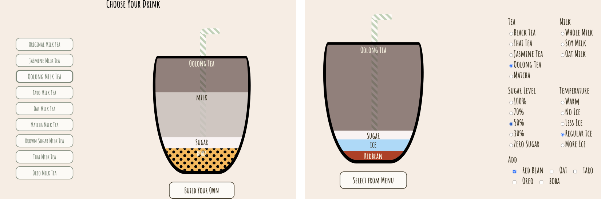

# Boba Tea Simulator Menu

## Overview

The Boba Tea Simulator Menu is an interactive web page that offers a delightful experience in exploring and simulating different boba tea drink choices. This engaging tool provides visual animations and detailed descriptions for various boba tea options, allowing users to virtually savor their favorite drinks and discover new ones.

You can access the Boba Tea Simulator Menu online by visiting [https://yikeli-vivi.github.io/Boba/](https://yikeli-vivi.github.io/Boba/).

## Features

- An extensive selection of boba tea drink choices.
- Engaging visual animations that simulate the preparation of each drink.
- Detailed descriptions of the ingredients and flavors for each drink.
- Interactive user interface for selecting and customizing boba tea orders.
- A delightful and immersive experience for boba tea enthusiasts.

## Usage

1. Visit the web page by clicking on the provided link.
2. Explore the menu to discover a wide variety of boba tea options.
3. Click on a drink to view its detailed description.
4. Customize your boba tea by selecting options like sweetness and toppings.
5. Watch the visual animation to see how your customized boba tea is prepared.
6. Enjoy the virtual boba tea experience!

---

Sip and simulate your favorite boba tea with the Boba Tea Simulator Menu!
